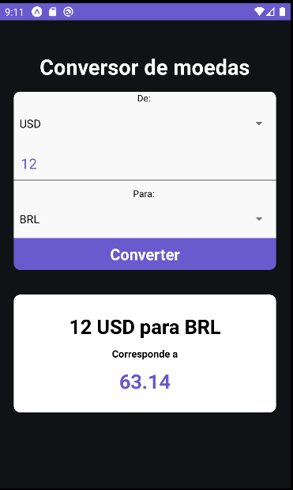
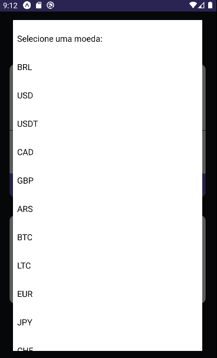

# Conversor de moedas com React-native
Desenvolvi esse aplicativo baseado em um projeto realizado no curso do Sujeito programador, fiz um upgrade e achei legal compartilhar com vocês! o mesmo, faz a conversão de moedas, puxando os valores reais de cada moeda via API (https://docs.awesomeapi.com.br/api-de-moedas) e realiza a conversão da moeda. 

# Tela inicial e lista de moedas

 

